# IntelliXCards - Authentication UI Architecture Diagram

This diagram visualizes the complete authentication architecture for the IntelliXCards application, showing the relationship between Astro pages, React components, API endpoints, and backend services.

## Architecture Overview

The authentication system follows a layered architecture:

- **Middleware Layer**: Handles session checking and Supabase client initialization
- **Public Pages**: Registration, login, and password recovery pages
- **React Components**: Interactive forms with client-side validation
- **API Endpoints**: Server-side validation and Supabase integration
- **Services**: Business logic and validation schemas

## Component Legend

- 🟢 **Green (NEW)**: Components to be created for authentication
- 🟠 **Orange (UPDATED)**: Existing components that require updates
- 🟡 **Light Green (EXISTING)**: Existing components without changes
- 🔴 **Red (BACKEND)**: Backend services and database

## Architecture Diagram

```mermaid
---
id: b9128b2b-8275-4a2c-bdf2-d77bc0687138
---
flowchart TD
    subgraph "Layouts"
        AL["AuthLayout.astro<br/>NEW"]
        ML["MainLayout.astro<br/>UPDATED"]
    end

    subgraph "Middleware Layer"
        MW["Middleware<br/>UPDATED"]
        SC["Supabase Client"]
        MW -->|"Initialize & attach to locals"| SC
    end

    subgraph "Public Auth Pages"
        RP["register.astro<br/>NEW"]
        LP["login.astro<br/>NEW"]
        RCP["recovery.astro<br/>NEW"]
        RSP["reset.astro<br/>NEW"]

        RP -->|Uses| AL
        LP -->|Uses| AL
        RCP -->|Uses| AL
        RSP -->|Uses| AL
    end

    subgraph "Auth React Components"
        RF["RegisterForm.tsx<br/>NEW"]
        LF["LoginForm.tsx<br/>NEW"]
        RCF["RecoveryForm.tsx<br/>NEW"]

        subgraph "Shared Auth UI"
            AFH["AuthFormHeader.tsx<br/>NEW"]
            PSM["PasswordStrengthMeter.tsx<br/>NEW"]
            ASM["AuthStatusMessage.tsx<br/>NEW"]
        end

        RF -->|Uses| AFH
        RF -->|Uses| PSM
        RF -->|Uses| ASM
        LF -->|Uses| AFH
        LF -->|Uses| ASM
        RCF -->|Uses| AFH
        RCF -->|Uses| ASM
    end

    subgraph "API Endpoints"
        ARE["register.ts<br/>NEW"]
        ALE["login.ts<br/>NEW"]
        ALO["logout.ts<br/>NEW"]
        ARC["recovery.ts<br/>NEW"]
    end

    subgraph "Services & Validation"
        AS["auth.service.ts<br/>NEW"]
        AV["auth.ts Zod Schemas<br/>NEW"]

        AS -->|Uses| AV
    end

    subgraph "Protected Pages"
        DP["dashboard.astro<br/>EXISTING"]
        PP["project pages<br/>EXISTING"]

        DP -->|Uses| ML
        PP -->|Uses| ML
    end

    subgraph "Navigation"
        AN["AppNav.astro<br/>UPDATED"]
        ML -->|Contains| AN
    end

    subgraph "Existing Components"
        DC["Dashboard Components"]
        PC["Project Components"]
        SC2["Study Components"]
        UI["UI Components Shadcn"]

        DP -->|Renders| DC
        PP -->|Renders| PC
        PP -->|Renders| SC2
    end

    subgraph "Backend"
        SB["Supabase Auth"]
        DB[("Database")]
        SB -->|Stores| DB
    end

    subgraph "Type Definitions"
        TD["types.ts<br/>UPDATED"]
        TD -->|Defines| AC["AuthCredentials"]
        TD -->|Defines| ASE["AuthSession"]
        TD -->|Defines| AER["AuthErrorResponse"]
    end

    %% Request Flow
    MW -->|"Checks session"| RP
    MW -->|"Checks session"| LP
    MW -->|"Checks session"| RCP
    MW -->|"Checks session"| DP
    MW -->|"Checks session"| PP

    %% Component to Page Connections
    RP -->|Renders| RF
    LP -->|Renders| LF
    RCP -->|Renders| RCF

    %% Form to API Flow
    RF -->|"POST fetch"| ARE
    LF -->|"POST fetch"| ALE
    RCF -->|"POST fetch"| ARC
    AN -->|"Logout action"| ALO

    %% API to Service Flow
    ARE -->|Uses| AS
    ALE -->|Uses| AS
    ALO -->|Uses| AS
    ARC -->|Uses| AS

    %% Service to Backend
    AS -->|"Calls auth methods"| SB

    %% API uses validation
    ARE -->|Validates| AV
    ALE -->|Validates| AV
    ARC -->|Validates| AV

    %% Navigation auth awareness
    AN -->|"Reads session from locals"| MW

    %% Success redirects
    RF -.->|"On success redirect"| DP
    LF -.->|"On success redirect"| DP

    %% Type usage
    RF -->|Uses| TD
    LF -->|Uses| TD
    RCF -->|Uses| TD
    ARE -->|Returns| TD
    ALE -->|Returns| TD

    %% Styling
    classDef newComponent fill:#a8e6cf,stroke:#333,stroke-width:2px
    classDef updatedComponent fill:#ffd3b6,stroke:#333,stroke-width:2px
    classDef existingComponent fill:#dcedc1,stroke:#333,stroke-width:2px
    classDef backend fill:#ffaaa5,stroke:#333,stroke-width:2px

    class AL,RP,LP,RCP,RSP,RF,LF,RCF,AFH,PSM,ASM,ARE,ALE,ALO,ARC,AS,AV,AC,ASE,AER newComponent
    class ML,MW,AN,TD updatedComponent
    class DP,PP,DC,PC,SC2,UI existingComponent
    class SB,DB,SC backend
```



## Key Data Flows

### 1. Registration Flow

```
User → RegisterForm.tsx → POST /api/auth/register → auth.service.ts → Supabase Auth → Database
                       ↓
                Success: Redirect to /dashboard
                Error: Display in AuthStatusMessage
```

### 2. Login Flow

```
User → LoginForm.tsx → POST /api/auth/login → auth.service.ts → Supabase Auth
                   ↓
            Success: Redirect to /dashboard
            Error: Display error message
```

### 3. Logout Flow

```
User clicks Logout in AppNav → POST /api/auth/logout → auth.service.ts → Supabase signOut
                            ↓
                    Clear session → Redirect to /auth/login
```

### 4. Password Recovery Flow

```
User → RecoveryForm.tsx → POST /api/auth/recovery → auth.service.ts → Supabase resetPassword
                       ↓
                Send email with reset link → User clicks link → reset.astro page
```

### 5. Middleware Protection

```
All requests → Middleware → Check session
                         ↓
            Session exists? → Allow access to protected pages
                         ↓
            No session? → Redirect /app/** to /auth/login
                       → Redirect /auth/** to /dashboard (if logged in)
```

## Component Responsibilities

### New Components

#### **AuthLayout.astro**

- Minimal authentication page shell
- Brand header and footer
- Dark mode support
- ViewTransitions integration

#### **RegisterForm.tsx**

- Email and password input fields
- Client-side validation
- Password strength meter integration
- Form submission to API
- Error/success message handling

#### **LoginForm.tsx**

- Email and password fields
- Client-side validation
- Form submission
- Error handling

#### **RecoveryForm.tsx**

- Email input for password reset
- Validation
- Success feedback

#### **AuthFormHeader.tsx**

- Reusable header for auth forms
- Title and description display

#### **PasswordStrengthMeter.tsx**

- Visual indicator of password strength
- Real-time validation feedback

#### **AuthStatusMessage.tsx**

- Display success/error messages
- Accessible ARIA live region

#### **API Endpoints (register.ts, login.ts, logout.ts, recovery.ts)**

- Server-side validation with Zod
- Supabase auth integration
- Session management
- Error handling and translation

#### **auth.service.ts**

- Authentication business logic
- Supabase method calls
- Error translation

#### **auth.ts (Validation)**

- Zod schemas for all auth forms
- Password complexity rules
- Email validation

### Updated Components

#### **MainLayout.astro**

- Expose navigation slot
- Pass session data to navigation
- Support auth-aware UI

#### **Middleware**

- Initialize Supabase client
- Attach client and session to locals
- Route protection logic
- Redirect unauthorized users

#### **AppNav.astro**

- Display "Login/Register" when unauthenticated
- Display user menu with "Logout" when authenticated
- Handle logout action

#### **types.ts**

- Add AuthCredentials type
- Add AuthSession type
- Add AuthErrorResponse type

## Security Considerations

1. **Middleware Protection**: All `/app/**` routes require authentication
2. **Session Validation**: Middleware checks session on every request
3. **HTTPS Enforcement**: Production environment uses secure cookies
4. **No User Enumeration**: Password recovery always returns success
5. **Client-side Throttling**: Form submissions debounced
6. **Server-side Validation**: All inputs validated with Zod schemas
7. **Secure Cookies**: HttpOnly, Secure, SameSite=Lax

## Integration Points

### With Existing Features

- Dashboard requires authentication (protected by middleware)
- Project pages require authentication
- Study sessions require authentication
- All API endpoints under `/api/projects/**` and `/api/study-sessions/**` use authenticated Supabase client from locals

### With Supabase

- Registration: `supabase.auth.signUp()`
- Login: `supabase.auth.signInWithPassword()`
- Logout: `supabase.auth.signOut()`
- Recovery: `supabase.auth.resetPasswordForEmail()`
- Session: `supabase.auth.getSession()`

## Technology Stack

- **Frontend**: Astro 5, React 19, TypeScript 5
- **Styling**: Tailwind 4, Shadcn/ui components
- **Backend**: Supabase Auth
- **Validation**: Zod
- **State Management**: React hooks, Astro locals
- **Routing**: Astro file-based routing with middleware
